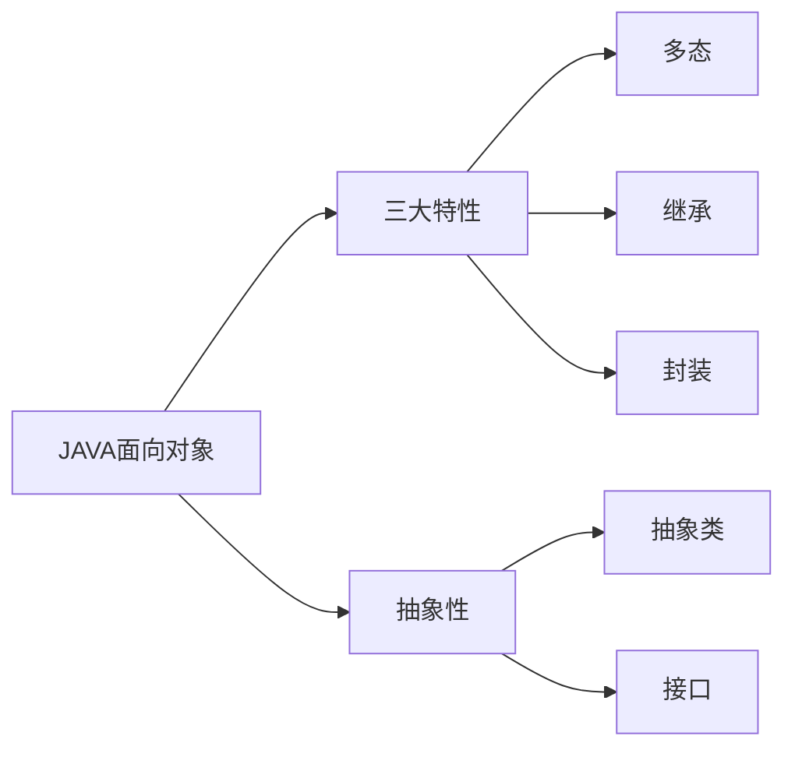

### 🤖 Assistant

### 第一周：面向对象编程

### Java 多态的全面解释

多态（Polymorphism）是面向对象编程（OOP）的三大特性之一（另外两个是封装和继承）。它允许不同的对象对同一消息做出不同的响应，从而增强了代码的灵活性和可扩展性。

---

### 1. 多态的定义
多态是指同一个方法或操作在不同对象上具有不同的行为。在 Java 中，多态主要通过以下两种方式实现：
1. **编译时多态（静态多态）**：通过方法重载（Overloading）实现。
2. **运行时多态（动态多态）**：通过方法重写（Overriding）和向上转型（Upcasting）实现。

---

### 2. 多态的类型

#### (1) 编译时多态（方法重载）
- **定义**：在同一个类中，多个方法具有相同的名称但参数列表不同（参数类型、数量或顺序）。
- **特点**：
  - 在编译时确定调用哪个方法。
  - 与继承无关。

**示例：**
```java
class Calculator {
    // 方法重载：加法
    public int add(int a, int b) {
        return a + b;
    }

    public double add(double a, double b) {
        return a + b;
    }

    public int add(int a, int b, int c) {
        return a + b + c;
    }
}

public class Main {
    public static void main(String[] args) {
        Calculator calc = new Calculator();
        System.out.println(calc.add(2, 3));           // 调用 add(int, int)
        System.out.println(calc.add(2.5, 3.5));       // 调用 add(double, double)
        System.out.println(calc.add(2, 3, 4));        // 调用 add(int, int, int)
    }
}
```

**输出：**
```
5
6.0
9
```

---

#### (2) 运行时多态（方法重写 + 向上转型）
- **定义**：子类重写父类的方法，并通过父类引用调用子类对象的方法。
- **特点**：
  - 在运行时确定调用哪个方法。
  - 依赖于继承和方法重写。

**示例：**
```java
class Animal {
    public void speak() {
        System.out.println("Animal makes a sound");
    }
}

class Dog extends Animal {
    @Override
    public void speak() {
        System.out.println("Dog barks");
    }
}

class Cat extends Animal {
    @Override
    public void speak() {
        System.out.println("Cat meows");
    }
}

public class Main {
    public static void main(String[] args) {
        Animal myAnimal; // 父类引用

        myAnimal = new Dog(); // 向上转型
        myAnimal.speak();     // 调用 Dog 的 speak()

        myAnimal = new Cat(); // 向上转型
        myAnimal.speak();     // 调用 Cat 的 speak()
    }
}
```

**输出：**
```
Dog barks
Cat meows
```

---

### 3. 多态的实现机制
- **向上转型（Upcasting）**：将子类对象赋值给父类引用。
  - 例如：`Animal myAnimal = new Dog();`
- **动态绑定（Dynamic Binding）**：在运行时根据实际对象类型确定调用哪个方法。
  - 例如：`myAnimal.speak()` 会根据 `myAnimal` 实际指向的对象（`Dog` 或 `Cat`）调用相应的方法。

---

### 4. 多态的优点
1. **代码复用**：通过继承和方法重写，减少重复代码。
2. **扩展性**：新增子类时，无需修改父类代码。
3. **灵活性**：同一方法可以根据对象类型执行不同的行为。

---

### 5. 多态的应用场景
1. **方法参数多态**：将父类类型作为方法参数，可以接受任意子类对象。
2. **集合多态**：使用父类类型存储子类对象。
3. **接口多态**：通过接口引用调用实现类的方法。

**示例：方法参数多态**
```java
class Zoo {
    public void makeAnimalSpeak(Animal animal) {
        animal.speak(); // 根据传入的对象类型调用相应的方法
    }
}

public class Main {
    public static void main(String[] args) {
        Zoo zoo = new Zoo();
        zoo.makeAnimalSpeak(new Dog()); // 输出: Dog barks
        zoo.makeAnimalSpeak(new Cat()); // 输出: Cat meows
    }
}
```

---

### 6. 多态的注意事项
1. **只能调用父类中定义的方法**：
  - 通过父类引用调用子类对象时，只能调用父类中定义的方法。
  - 如果需要调用子类特有的方法，必须向下转型（Downcasting）。

**示例：向下转型**
```java
Animal myAnimal = new Dog();
if (myAnimal instanceof Dog) {
    Dog myDog = (Dog) myAnimal; // 向下转型
    myDog.fetch(); // 调用 Dog 特有的方法
}
```

2. **避免滥用多态**：
  - 过度使用多态可能导致代码可读性降低。
  - 需要根据实际需求合理设计类和继承关系。

---

### 7. 总结
- **多态**是 Java 面向对象编程的核心特性之一，通过方法重载和方法重写实现。
- **编译时多态**通过方法重载实现，**运行时多态**通过方法重写和向上转型实现。
- 多态提高了代码的灵活性、可扩展性和可维护性，但也需要注意合理使用。

### Java 继承的全面解释

继承（Inheritance）是面向对象编程（OOP）的三大特性之一（另外两个是封装和多态）。它允许一个类（子类）基于另一个类（父类）构建，从而复用父类的属性和方法，并扩展或修改其行为。

---

### 1. 继承的定义
- **继承**是指一个类（子类）从另一个类（父类）获取属性和方法的过程。
- 子类可以：
  - 复用父类的属性和方法。
  - 重写父类的方法（方法重写）。
  - 添加新的属性和方法。

---

### 2. 继承的语法
在 Java 中，使用 `extends` 关键字实现继承。

**语法：**
```java
class 父类 {
    // 父类的属性和方法
}

class 子类 extends 父类 {
    // 子类的属性和方法
}
```

---

### 3. 继承的特点
1. **代码复用**：子类可以直接使用父类的属性和方法，减少重复代码。
2. **扩展性**：子类可以在父类的基础上添加新的功能。
3. **方法重写**：子类可以重写父类的方法，实现多态。
4. **单继承**：Java 只支持单继承，即一个子类只能有一个父类。

---

### 4. 继承的示例

#### 示例 1：基本继承
```java
// 父类
class Animal {
    protected String name;

    public Animal(String name) {
        this.name = name;
    }

    public void speak() {
        System.out.println(name + " makes a sound");
    }
}

// 子类
class Dog extends Animal {
    public Dog(String name) {
        super(name); // 调用父类的构造方法
    }

    // 重写父类方法
    @Override
    public void speak() {
        System.out.println(name + " barks");
    }
}

public class Main {
    public static void main(String[] args) {
        Dog myDog = new Dog("Buddy");
        myDog.speak(); // 调用子类重写的方法
    }
}
```

**输出：**
```
Buddy barks
```

**说明：**
- `Dog` 类继承了 `Animal` 类的 `name` 属性和 `speak()` 方法。
- `Dog` 类重写了 `speak()` 方法，实现了自己的行为。

---

#### 示例 2：多层继承
```java
// 父类
class Animal {
    protected String name;

    public Animal(String name) {
        this.name = name;
    }

    public void eat() {
        System.out.println(name + " is eating");
    }
}

// 子类
class Dog extends Animal {
    public Dog(String name) {
        super(name);
    }

    public void bark() {
        System.out.println(name + " is barking");
    }
}

// 孙子类
class Puppy extends Dog {
    public Puppy(String name) {
        super(name);
    }

    public void play() {
        System.out.println(name + " is playing");
    }
}

public class Main {
    public static void main(String[] args) {
        Puppy myPuppy = new Puppy("Max");
        myPuppy.eat();  // 继承自 Animal
        myPuppy.bark(); // 继承自 Dog
        myPuppy.play(); // Puppy 自己的方法
    }
}
```

**输出：**
```
Max is eating
Max is barking
Max is playing
```

**说明：**
- `Puppy` 类继承了 `Dog` 类的属性和方法，而 `Dog` 类又继承了 `Animal` 类的属性和方法。
- 这种多层继承关系可以形成更复杂的类层次结构。

---

### 5. 继承中的关键字

#### (1) `super`
- 用于在子类中访问父类的构造方法、属性和方法。
- 示例：
  ```java
  class Dog extends Animal {
      public Dog(String name) {
          super(name); // 调用父类的构造方法
      }
  }
  ```

#### (2) `this`
- 用于在子类中访问当前对象的属性和方法。
- 示例：
  ```java
  class Dog extends Animal {
      private String breed;

      public Dog(String name, String breed) {
          super(name);
          this.breed = breed; // 访问当前对象的属性
      }
  }
  ```

---

### 6. 继承的注意事项
1. **单继承限制**：Java 不支持多继承，即一个子类只能有一个父类。
  - 解决方案：使用接口实现多继承的效果。
2. **构造方法的调用**：
  - 子类构造方法默认会调用父类的无参构造方法。
  - 如果父类没有无参构造方法，子类必须显式调用父类的有参构造方法。
3. **访问权限**：
  - 子类不能直接访问父类的私有成员（`private`）。
  - 可以使用 `protected` 或 `public` 修饰符来允许子类访问。

---

### 7. 继承与组合
- **继承**：表示“是一个”（is-a）关系，例如 `Dog` 是一个 `Animal`。
- **组合**：表示“有一个”（has-a）关系，例如 `Car` 有一个 `Engine`。
- 在实际开发中，应根据需求选择继承或组合。

**组合示例：**
```java
class Engine {
    public void start() {
        System.out.println("Engine starts");
    }
}

class Car {
    private Engine engine;

    public Car() {
        engine = new Engine();
    }

    public void start() {
        engine.start();
        System.out.println("Car starts");
    }
}

public class Main {
    public static void main(String[] args) {
        Car myCar = new Car();
        myCar.start();
    }
}
```

**输出：**
```
Engine starts
Car starts
```

---

### 8. 总结
- **继承**是 Java 面向对象编程的核心特性之一，用于实现代码复用和扩展。
- 通过 `extends` 关键字实现继承，子类可以复用父类的属性和方法，并重写或扩展其行为。
- 需要注意单继承限制、构造方法调用和访问权限等问题。
- 在实际开发中，应根据需求合理选择继承或组合。
### Java 封装的全面解释

封装（Encapsulation）是面向对象编程（OOP）的三大特性之一（另外两个是继承和多态）。它通过将数据（属性）和行为（方法）捆绑在一起，并限制对数据的直接访问，从而增强了代码的安全性和可维护性。

---

### 1. 封装的定义
- **封装**是指将类的属性和方法隐藏在类内部，只通过公共接口（方法）访问和修改数据。
- 封装的核心思想是“隐藏实现细节，暴露必要接口”。

---

### 2. 封装的目的
1. **数据保护**：防止外部代码直接修改类的内部数据，确保数据的完整性。
2. **代码复用**：通过封装，可以将复杂的实现细节隐藏起来，简化外部调用。
3. **灵活性**：封装允许在不影响外部代码的情况下修改类的内部实现。

---

### 3. 封装的实现
在 Java 中，封装主要通过以下方式实现：
1. **访问修饰符**：控制类成员的访问权限。
  - `private`：只能在类内部访问。
  - `protected`：可以在类内部、子类和同一包内访问。
  - `public`：可以在任何地方访问。
  - 默认（无修饰符）：可以在同一包内访问。
2. **Getter 和 Setter 方法**：提供对私有属性的安全访问和修改。

---

### 4. 封装的示例

#### 示例 1：基本封装
```java
class Person {
    // 私有属性
    private String name;
    private int age;

    // 公共构造方法
    public Person(String name, int age) {
        this.name = name;
        this.age = age;
    }

    // Getter 方法
    public String getName() {
        return name;
    }

    public int getAge() {
        return age;
    }

    // Setter 方法
    public void setName(String name) {
        this.name = name;
    }

    public void setAge(int age) {
        if (age > 0) { // 数据校验
            this.age = age;
        } else {
            System.out.println("Invalid age!");
        }
    }

    // 公共方法
    public void displayInfo() {
        System.out.println("Name: " + name + ", Age: " + age);
    }
}

public class Main {
    public static void main(String[] args) {
        Person person = new Person("Alice", 25);

        // 使用 Getter 方法访问属性
        System.out.println("Name: " + person.getName());
        System.out.println("Age: " + person.getAge());

        // 使用 Setter 方法修改属性
        person.setName("Bob");
        person.setAge(30);

        // 显示信息
        person.displayInfo();
    }
}
```

**输出：**
```
Name: Alice
Age: 25
Name: Bob, Age: 30
```

**说明：**
- `name` 和 `age` 属性被声明为 `private`，外部代码无法直接访问。
- 通过 `getName()` 和 `getAge()` 方法访问属性。
- 通过 `setName()` 和 `setAge()` 方法修改属性，并在 `setAge()` 中添加了数据校验。

---

#### 示例 2：封装与数据校验
```java
class BankAccount {
    // 私有属性
    private String accountNumber;
    private double balance;

    // 公共构造方法
    public BankAccount(String accountNumber, double balance) {
        this.accountNumber = accountNumber;
        this.balance = balance;
    }

    // Getter 方法
    public String getAccountNumber() {
        return accountNumber;
    }

    public double getBalance() {
        return balance;
    }

    // 存款方法
    public void deposit(double amount) {
        if (amount > 0) {
            balance += amount;
            System.out.println("Deposit successful. New balance: " + balance);
        } else {
            System.out.println("Invalid deposit amount!");
        }
    }

    // 取款方法
    public void withdraw(double amount) {
        if (amount > 0 && amount <= balance) {
            balance -= amount;
            System.out.println("Withdrawal successful. New balance: " + balance);
        } else {
            System.out.println("Invalid withdrawal amount!");
        }
    }
}

public class Main {
    public static void main(String[] args) {
        BankAccount account = new BankAccount("123456789", 1000);

        // 存款
        account.deposit(500);

        // 取款
        account.withdraw(200);

        // 尝试取款超过余额
        account.withdraw(2000);

        // 显示余额
        System.out.println("Final balance: " + account.getBalance());
    }
}
```

**输出：**
```
Deposit successful. New balance: 1500.0
Withdrawal successful. New balance: 1300.0
Invalid withdrawal amount!
Final balance: 1300.0
```

**说明：**
- `balance` 属性被封装，外部代码无法直接修改。
- 通过 `deposit()` 和 `withdraw()` 方法修改余额，并添加了数据校验。

---

### 5. 封装的好处
1. **数据安全**：通过限制对数据的直接访问，防止数据被意外修改。
2. **代码可维护性**：封装隐藏了实现细节，使代码更易于维护和扩展。
3. **灵活性**：可以在不改变外部接口的情况下修改类的内部实现。

---

### 6. 封装的注意事项
1. **合理使用访问修饰符**：
  - 将属性声明为 `private`，确保数据安全。
  - 将方法声明为 `public`，提供必要的接口。
2. **避免过度封装**：
  - 过度封装可能导致代码冗余和复杂性增加。
  - 应根据实际需求合理设计类的封装程度。

---

### 7. 总结
- **封装**是 Java 面向对象编程的核心特性之一，通过访问修饰符和 Getter/Setter 方法实现。
- 封装增强了代码的安全性、可维护性和灵活性。
- 在实际开发中，应根据需求合理设计类的封装程度，避免过度封装。
### Java 抽象类的全面解释

抽象类（Abstract Class）是 Java 中一种特殊的类，用于定义部分实现和部分未实现的方法。它介于普通类和接口之间，既包含具体方法，也包含抽象方法。抽象类通常用于定义通用行为和属性，同时允许子类提供具体实现。

---

### 1. 抽象类的定义
- **抽象类**是用 `abstract` 关键字修饰的类。
- 抽象类可以包含：
  - 抽象方法（没有方法体）。
  - 具体方法（有方法体）。
  - 属性（变量）。
  - 构造方法。
- 抽象类不能被实例化，只能通过子类继承。

---

### 2. 抽象类的特点
1. **部分实现**：抽象类可以包含具体方法和抽象方法。
2. **继承**：子类必须实现抽象类中的所有抽象方法（除非子类也是抽象类）。
3. **通用行为**：抽象类通常用于定义通用行为和属性，供子类复用。

---

### 3. 抽象类的语法

**定义抽象类：**
```java
abstract class 类名 {
    // 属性
    private 数据类型 属性名;

    // 构造方法
    public 类名(参数列表) {
        // 初始化属性
    }

    // 抽象方法
    abstract 返回类型 方法名();

    // 具体方法
    public 返回类型 方法名() {
        // 方法体
    }
}
```

**继承抽象类：**
```java
class 子类名 extends 抽象类名 {
    // 实现抽象方法
    @Override
    public 返回类型 方法名() {
        // 具体实现
    }
}
```

---

### 4. 抽象类的示例

#### 示例 1：基本抽象类
```java
// 定义抽象类
abstract class Animal {
    private String name;

    // 构造方法
    public Animal(String name) {
        this.name = name;
    }

    // 具体方法
    public void eat() {
        System.out.println(name + " is eating");
    }

    // 抽象方法
    public abstract void makeSound();
}

// 继承抽象类
class Dog extends Animal {
    public Dog(String name) {
        super(name);
    }

    // 实现抽象方法
    @Override
    public void makeSound() {
        System.out.println("Dog barks");
    }
}

class Cat extends Animal {
    public Cat(String name) {
        super(name);
    }

    @Override
    public void makeSound() {
        System.out.println("Cat meows");
    }
}

public class Main {
    public static void main(String[] args) {
        Animal myDog = new Dog("Buddy");
        Animal myCat = new Cat("Whiskers");

        myDog.eat();
        myDog.makeSound();

        myCat.eat();
        myCat.makeSound();
    }
}
```

**输出：**
```
Buddy is eating
Dog barks
Whiskers is eating
Cat meows
```

**说明：**
- `Animal` 是一个抽象类，包含一个具体方法 `eat()` 和一个抽象方法 `makeSound()`。
- `Dog` 和 `Cat` 类继承 `Animal` 并实现了 `makeSound()` 方法。
- 通过抽象类引用调用方法，实现了多态性。

---

#### 示例 2：抽象类中的属性
```java
// 定义抽象类
abstract class Shape {
    private String color;

    // 构造方法
    public Shape(String color) {
        this.color = color;
    }

    // 具体方法
    public String getColor() {
        return color;
    }

    // 抽象方法
    public abstract double getArea();
}

// 继承抽象类
class Circle extends Shape {
    private double radius;

    public Circle(String color, double radius) {
        super(color);
        this.radius = radius;
    }

    @Override
    public double getArea() {
        return Math.PI * radius * radius;
    }
}

class Rectangle extends Shape {
    private double width;
    private double height;

    public Rectangle(String color, double width, double height) {
        super(color);
        this.width = width;
        this.height = height;
    }

    @Override
    public double getArea() {
        return width * height;
    }
}

public class Main {
    public static void main(String[] args) {
        Shape circle = new Circle("Red", 5);
        Shape rectangle = new Rectangle("Blue", 4, 6);

        System.out.println("Circle color: " + circle.getColor() + ", Area: " + circle.getArea());
        System.out.println("Rectangle color: " + rectangle.getColor() + ", Area: " + rectangle.getArea());
    }
}
```

**输出：**
```
Circle color: Red, Area: 78.53981633974483
Rectangle color: Blue, Area: 24.0
```

**说明：**
- `Shape` 是一个抽象类，包含一个属性 `color` 和一个抽象方法 `getArea()`。
- `Circle` 和 `Rectangle` 类继承 `Shape` 并实现了 `getArea()` 方法。

---

### 5. 抽象类的构造方法
- 抽象类可以有构造方法，用于初始化属性。
- 子类通过 `super()` 调用抽象类的构造方法。

**示例：**
```java
abstract class Person {
    private String name;

    // 构造方法
    public Person(String name) {
        this.name = name;
    }

    public String getName() {
        return name;
    }

    public abstract void introduce();
}

class Student extends Person {
    public Student(String name) {
        super(name);
    }

    @Override
    public void introduce() {
        System.out.println("I am a student named " + getName());
    }
}

public class Main {
    public static void main(String[] args) {
        Person student = new Student("Alice");
        student.introduce();
    }
}
```

**输出：**
```
I am a student named Alice
```

---

### 6. 抽象类与接口的区别
| 特性               | 抽象类（Abstract Class）       | 接口（Interface）               |
|--------------------|-------------------------------|--------------------------------|
| 方法实现           | 可以包含具体方法和抽象方法     | 只能包含抽象方法（Java 8 前）  |
| 属性               | 可以是普通属性                | 只能是常量                     |
| 继承               | 单继承                       | 支持多继承（实现多个接口）     |
| 设计目的           | 定义通用行为和属性            | 定义行为规范                   |

---

### 7. 抽象类的应用场景
1. **定义通用行为**：例如 `Animal` 类定义所有动物的通用行为（如 `eat()`）。
2. **部分实现**：当某些方法可以在父类中实现，而其他方法需要子类实现时。
3. **代码复用**：通过抽象类复用通用代码，减少重复。

---

### 8. 总结
- **抽象类**是 Java 中定义部分实现和部分未实现方法的工具，通过 `abstract` 关键字定义。
- 抽象类可以包含属性、构造方法、具体方法和抽象方法。
- 子类必须实现抽象类中的所有抽象方法（除非子类也是抽象类）。
- 抽象类与接口的区别在于设计目的和实现方式。
### Java 接口的全面解释

接口（Interface）是 Java 中一种重要的抽象机制，用于定义一组方法签名（没有方法体），并允许类通过实现接口来提供具体的行为。接口是实现多态性和解耦设计的关键工具。

---

### 1. 接口的定义
- **接口**是一种完全抽象的类，用于定义一组方法的规范。
- 接口中的方法默认是 `public abstract` 的（即使不显式声明）。
- 接口中的属性默认是 `public static final` 的（即常量）。

---

### 2. 接口的特点
1. **完全抽象**：接口中的方法没有方法体，必须由实现类提供具体实现。
2. **多继承**：一个类可以实现多个接口，弥补了 Java 单继承的限制。
3. **解耦设计**：接口将方法的定义与实现分离，增强了代码的灵活性和可扩展性。

---

### 3. 接口的语法

**定义接口：**
```java
interface 接口名 {
    // 方法签名
    void 方法名();
}
```

**实现接口：**
```java
class 类名 implements 接口名 {
    // 实现接口中的方法
    @Override
    public void 方法名() {
        // 具体实现
    }
}
```

---

### 4. 接口的示例

#### 示例 1：基本接口
```java
// 定义接口
interface Animal {
    void makeSound(); // 方法签名
}

// 实现接口
class Dog implements Animal {
    @Override
    public void makeSound() {
        System.out.println("Dog barks");
    }
}

class Cat implements Animal {
    @Override
    public void makeSound() {
        System.out.println("Cat meows");
    }
}

public class Main {
    public static void main(String[] args) {
        Animal myDog = new Dog();
        Animal myCat = new Cat();

        myDog.makeSound(); // 调用 Dog 的实现
        myCat.makeSound(); // 调用 Cat 的实现
    }
}
```

**输出：**
```
Dog barks
Cat meows
```

**说明：**
- `Animal` 接口定义了一个方法 `makeSound()`。
- `Dog` 和 `Cat` 类分别实现了 `Animal` 接口，并提供了具体实现。
- 通过接口引用调用方法，实现了多态性。

---

#### 示例 2：接口中的常量
```java
// 定义接口
interface Constants {
    double PI = 3.14159; // 默认是 public static final
}

// 使用接口中的常量
class Circle implements Constants {
    private double radius;

    public Circle(double radius) {
        this.radius = radius;
    }

    public double getArea() {
        return PI * radius * radius;
    }
}

public class Main {
    public static void main(String[] args) {
        Circle circle = new Circle(5);
        System.out.println("Area of circle: " + circle.getArea());
    }
}
```

**输出：**
```
Area of circle: 78.53975
```

**说明：**
- `Constants` 接口定义了一个常量 `PI`。
- `Circle` 类实现了 `Constants` 接口，并使用 `PI` 计算圆的面积。

---

#### 示例 3：多接口实现
```java
// 定义接口
interface Flyable {
    void fly();
}

interface Swimmable {
    void swim();
}

// 实现多个接口
class Duck implements Flyable, Swimmable {
    @Override
    public void fly() {
        System.out.println("Duck is flying");
    }

    @Override
    public void swim() {
        System.out.println("Duck is swimming");
    }
}

public class Main {
    public static void main(String[] args) {
        Duck duck = new Duck();
        duck.fly();
        duck.swim();
    }
}
```

**输出：**
```
Duck is flying
Duck is swimming
```

**说明：**
- `Duck` 类实现了 `Flyable` 和 `Swimmable` 两个接口。
- 通过多接口实现，`Duck` 类具备了飞行和游泳的能力。

---

### 5. 接口的默认方法和静态方法（Java 8+）

#### (1) 默认方法
- 默认方法允许在接口中提供方法的具体实现。
- 实现类可以选择重写默认方法，也可以直接使用。

**示例：**
```java
interface Vehicle {
    default void start() {
        System.out.println("Vehicle is starting");
    }
}

class Car implements Vehicle {
    // 可以选择重写默认方法
    @Override
    public void start() {
        System.out.println("Car is starting");
    }
}

public class Main {
    public static void main(String[] args) {
        Vehicle car = new Car();
        car.start();
    }
}
```

**输出：**
```
Car is starting
```

---

#### (2) 静态方法
- 静态方法可以直接通过接口名调用，不需要实现类。

**示例：**
```java
interface MathUtils {
    static int add(int a, int b) {
        return a + b;
    }
}

public class Main {
    public static void main(String[] args) {
        int result = MathUtils.add(5, 3);
        System.out.println("Result: " + result);
    }
}
```

**输出：**
```
Result: 8
```

---

### 6. 接口与抽象类的区别
| 特性   | 接口（Interface）    | 抽象类（Abstract Class） |
|------|------------------|---------------------|
| 方法实现 | 不能有方法体（Java 8 前） | 可以有方法体              |
| 属性   | 只能是常量            | 可以是普通属性             |
| 继承   | 支持多继承（实现多个接口）    | 单继承                 |
| 设计目的 | 定义行为规范           | 定义通用行为和属性           |

---

### 7. 接口的应用场景
1. **定义行为规范**：例如 `Comparable` 接口用于定义对象的比较规则。
2. **实现多态性**：通过接口引用调用不同实现类的方法。
3. **解耦设计**：将方法的定义与实现分离，增强代码的灵活性和可扩展性。

---

### 8. 总结
- **接口**是 Java 中定义行为规范的重要工具，通过 `interface` 关键字定义。
- 接口中的方法默认是 `public abstract` 的，属性默认是 `public static final` 的。
- 接口支持多继承，弥补了 Java 单继承的限制。
- 接口的默认方法和静态方法（Java 8+）增强了接口的功能。
- 接口与抽象类的区别在于设计目的和实现方式。

### 补充内容
### `super` 关键字的详细解释

`super` 是 Java 中的一个关键字，用于在子类中访问父类的成员（属性、方法或构造方法）。它在面向对象编程中非常重要，尤其是在继承和多态的上下文中。

---

### 1. `super` 的主要用途
`super` 关键字有以下三种主要用途：

#### (1) 调用父类的构造方法
- 子类可以通过 `super()` 调用父类的构造方法。
- 必须在子类构造方法的第一行使用 `super()`。
- 如果父类没有无参构造方法，子类必须显式调用父类的有参构造方法。

**示例：**
```java
class Animal {
    private String name;

    // 父类构造方法
    public Animal(String name) {
        this.name = name;
    }

    public void speak() {
        System.out.println(name + " makes a sound");
    }
}

class Dog extends Animal {
    // 子类构造方法
    public Dog(String name) {
        super(name); // 调用父类的构造方法
    }

    @Override
    public void speak() {
        System.out.println(getName() + " barks");
    }
}
```

**说明：**
- 在 `Dog` 类的构造方法中，`super(name)` 调用了 `Animal` 类的构造方法，将 `name` 传递给父类。

---

#### (2) 访问父类的成员（属性或方法）
- 子类可以通过 `super.成员名` 访问父类的属性或方法。
- 当子类重写了父类的方法时，可以通过 `super.方法名()` 调用父类的原始方法。

**示例：**
```java
class Animal {
    protected String name;

    public Animal(String name) {
        this.name = name;
    }

    public void speak() {
        System.out.println(name + " makes a sound");
    }
}

class Dog extends Animal {
    public Dog(String name) {
        super(name);
    }

    @Override
    public void speak() {
        super.speak(); // 调用父类的 speak 方法
        System.out.println(name + " also barks");
    }
}
```

**说明：**
- 在 `Dog` 类的 `speak()` 方法中，`super.speak()` 调用了父类 `Animal` 的 `speak()` 方法。
- 这样可以保留父类的行为，同时扩展子类的功能。

---

#### (3) 解决父类和子类成员名称冲突
- 如果子类和父类有同名的属性或方法，可以使用 `super` 关键字明确指定访问父类的成员。

**示例：**
```java
class Animal {
    protected String sound = "Generic sound";
}

class Dog extends Animal {
    private String sound = "Bark";

    public void displaySounds() {
        System.out.println("Parent sound: " + super.sound); // 访问父类的 sound
        System.out.println("Child sound: " + this.sound);   // 访问子类的 sound
    }
}
```

**说明：**
- 在 `Dog` 类中，`super.sound` 访问父类 `Animal` 的 `sound` 属性，而 `this.sound` 访问子类 `Dog` 的 `sound` 属性。

---

### 2. `super` 的使用规则
- **必须在子类中使用**：`super` 只能在子类中使用，不能在静态方法中使用。
- **必须在构造方法的第一行**：如果使用 `super()` 调用父类构造方法，必须放在子类构造方法的第一行。
- **不能与 `this()` 同时使用**：在同一个构造方法中，不能同时使用 `super()` 和 `this()`。

---

### 3. 示例代码
以下是一个完整的示例，展示了 `super` 的三种用途：

```java
class Animal {
    protected String name;

    // 父类构造方法
    public Animal(String name) {
        this.name = name;
    }

    // 父类方法
    public void speak() {
        System.out.println(name + " makes a sound");
    }
}

class Dog extends Animal {
    private String sound;

    // 子类构造方法
    public Dog(String name, String sound) {
        super(name); // 调用父类构造方法
        this.sound = sound;
    }

    // 重写父类方法
    @Override
    public void speak() {
        super.speak(); // 调用父类方法
        System.out.println(name + " also " + sound);
    }

    // 访问父类和子类的成员
    public void displayInfo() {
        System.out.println("Parent name: " + super.name); // 访问父类属性
        System.out.println("Child sound: " + this.sound); // 访问子类属性
    }
}

public class Main {
    public static void main(String[] args) {
        Dog myDog = new Dog("Buddy", "barks");
        myDog.speak();
        myDog.displayInfo();
    }
}
```

**输出：**
```
Buddy makes a sound
Buddy also barks
Parent name: Buddy
Child sound: barks
```

---

### 4. 总结
- `super` 关键字用于在子类中访问父类的构造方法、属性和方法。
- 它解决了子类和父类之间的成员冲突，并支持方法重写时的父类方法调用。
- 合理使用 `super` 可以提高代码的可读性和可维护性，同时确保继承关系的正确性。
